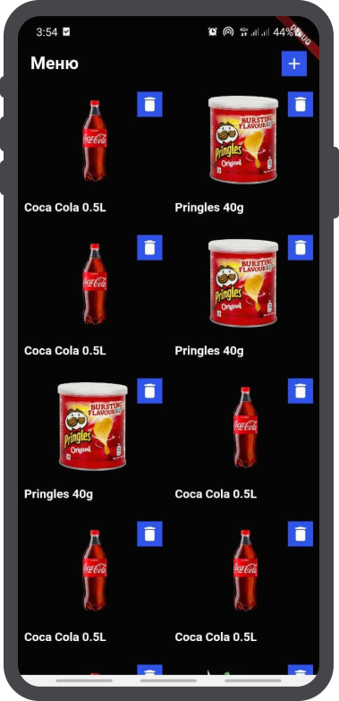

# Screenshots

https://www.figma.com/file/yKp6zEiqNfbBl8CB62M5VN/Untitled?node-id=0%3A1

Небольшое приложение со списком товаров.

При старте приложения необходимо сгенерировать список из n (рандомно от 10000 до 100000 штук, картинки и названия могут повторяться! хватит несколько штук) товаров и отобразить их
Любой товар можно удалить из списка
Также можно добавить товары в список (просто кнопка + с добавлением сгенерированного товара)
Картинка товара должна грузится из интернета
При генерации и добавлении товара он должен браться случайным образом из заранее созданного словаря (наименование+картинка)
Карточка товара должна быть квадратной (при любом разрешении экрана)
Иконку корзины и добавления можно использовать любую стандартную

A small application with a list of products.

When starting the application, you need to generate a list of n (randomly from 10,000 to 100,000 items, pictures and names can be repeated! A few pieces are enough) of goods and display them
Any product can be removed from the list
You can also add products to the list (just the + button with the addition of the generated product)
The picture of the product must be loaded from the Internet
When generating and adding a product, it must be taken randomly from a previously created dictionary (name + picture)
Product card must be square (at any screen resolution)
The cart and add icon can be used with any standard
